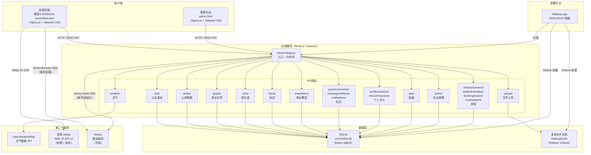

# SummitLink 系统架构

本文档描述 SummitLink（巅峰探索）的整体架构、模块划分及第三方依赖关系。

---

## 整体架构图

---

## 模块说明

### 前端页面

| 文件 | 说明 |
|------|------|
| `攀登4-20260416-summitlink.html` | 主前端单页应用（SPA）。使用 Alpine.js 管理状态，Tailwind CSS 样式，内嵌高德地图 SDK。包含：首页、探索、社区聊天、装备、个人中心五大 Tab |
| `admin.html` | 后台管理面板。含向导/俱乐部审核、商业攀登审核、用户管理、内容管理等功能 |

### 后端入口与中间件

| 文件 | 说明 |
|------|------|
| `backend/app.js` | Express 应用入口。配置 CORS（生产白名单）、JSON 解析、静态文件服务、路由挂载、健康检查、Sentry 初始化（条件）、AMAP_KEY 注入、生产安全校验 |
| `backend/middleware/auth.js` | 普通用户 JWT 鉴权中间件 |
| `backend/middleware/adminAuth.js` | 管理员 JWT 鉴权中间件 |

### 后端 API 分组

| 路由前缀 | 文件 | 主要功能 |
|----------|------|----------|
| `/api/auth` | `routes/auth.js` | 注册、登录、短信验证码登录、微信/Apple 登录（mock）、用户设置 |
| `/api/peaks` | `routes/peaks.js` | 山峰列表与详情、山峰天气代理 |
| `/api/weather` | `routes/weather.js` | 天气数据（代理 OpenWeatherMap）、营地分层天气、7 天预报 |
| `/api/guides` | `routes/guides.js` | 向导列表、申请入驻、审核状态 |
| `/api/clubs` | `routes/clubs.js` | 俱乐部列表、入驻申请、管理 |
| `/api/tracks` | `routes/tracks.js` | 轨迹记录（CRUD）、GPX/KML 导出 |
| `/api/expeditions` | `routes/expeditions.js` | 商业攀登发布、下单、模拟支付 |
| `/api/posts` | `routes/posts.js` | 社区帖子（含图片）|
| `/api/comments` | `routes/comments.js` | 帖子评论（含图片）|
| `/api/messages` | `routes/messages.js` | 私信会话与消息（含图片，限流 30次/分钟）|
| `/api/follows` | `routes/follows.js` | 关注/取消关注 |
| `/api/notifications` | `routes/notifications.js` | 通知中心 |
| `/api/articles` | `routes/articles.js` | 攀登文章（分类浏览）|
| `/api/profile` | `routes/profile.js` | 个人医疗信息、紧急联系人 |
| `/api/customs` | `routes/customs.js` | 定制攀登申请 |
| `/api/rescue` | `routes/rescue.js` | 救援联系方式、SOS 记录 |
| `/api/insurance` | `routes/insurance.js` | 保险产品（预留）|
| `/api/gear` | `routes/gear.js` | 装备买卖市场 |
| `/api/leaderboard` | `routes/leaderboard.js` | 登顶榜 |
| `/api/banners` | `routes/banners.js` | 首页 Banner |
| `/api/pay` | `routes/pay.js` | 支付订单（mock）|
| `/api/bookings` | `routes/bookings.js` | 预约管理 |
| `/api/users` | `routes/users.js` | 用户信息、成就、关注列表 |
| `/api/routes` | `routes/routes.js` | 攀登线路（管理）|
| `/api/teams` | `routes/teams.js` | 队伍管理 |
| `/api/upload` | `routes/upload.js` | 单图/多图上传（JWT 鉴权，限流）|
| `/api/admin` | `routes/admin.js` | 后台管理接口（管理员 JWT 鉴权）|

### 数据库

| 文件 | 说明 |
|------|------|
| `backend/db/database.js` | SQLite 数据库初始化、表创建、迁移（ALTER TABLE 检查列是否存在再追加）|
| `backend/db/seed.js` | 示例数据填充（通过 `SEED_ON_START=true` 或直接运行触发，已有数据时跳过）|

### 测试

| 文件 | 说明 |
|------|------|
| `tests/e2e.spec.js` | Playwright E2E 测试主文件 |
| `tests/weather-camps.spec.js` | 营地天气专项 E2E 测试 |
| `tests/api.test.js` | 后端 API 集成测试 |
| `playwright.config.js` | Playwright 配置（运行在 Railway 生产环境 URL）|

### 部署配置

| 文件 | 说明 |
|------|------|
| `railway.toml` | Railway 平台构建与启动命令配置 |
| `railpack.toml` | Railpack 构建器配置（Node.js 20 + Python3）|
| `.env.example` | 环境变量模板 |
| `.gitignore` | 忽略 `.env`、`node_modules`、SQLite 数据库文件等 |

### CI / GitHub Actions

| 目录 | 说明 |
|------|------|
| `.github/` | GitHub Actions 工作流配置 |

---

## 第三方依赖

| 服务 / 库 | 用途 | 官网 |
|-----------|------|------|
| **OpenWeatherMap** | 天气数据（当前天气、7 天预报、营地分层天气）| [openweathermap.org](https://openweathermap.org) |
| **高德地图 AMap Web JS API v2** | 前端地图渲染、实时定位、轨迹 Polyline 显示 | [amap.com](https://lbs.amap.com) |
| **Sentry** | 错误监控与性能追踪（可选，通过 `SENTRY_DSN` 控制）| [sentry.io](https://sentry.io) |
| **better-sqlite3** | SQLite 数据库驱动（同步 API）| [npmjs.com/package/better-sqlite3](https://www.npmjs.com/package/better-sqlite3) |
| **Express.js** | HTTP 框架 | [expressjs.com](https://expressjs.com) |
| **jsonwebtoken** | JWT 签发与验证 | [npmjs.com/package/jsonwebtoken](https://www.npmjs.com/package/jsonwebtoken) |
| **bcrypt** | 密码哈希 | [npmjs.com/package/bcrypt](https://www.npmjs.com/package/bcrypt) |
| **multer** | 文件上传处理 | [npmjs.com/package/multer](https://www.npmjs.com/package/multer) |
| **express-rate-limit** | 速率限制（上传、消息、管理员登录等）| [npmjs.com/package/express-rate-limit](https://www.npmjs.com/package/express-rate-limit) |
| **Alpine.js** | 前端响应式状态管理（CDN 加载）| [alpinejs.dev](https://alpinejs.dev) |
| **Tailwind CSS** | 前端 CSS 框架（CDN 加载）| [tailwindcss.com](https://tailwindcss.com) |
| **Railway** | 云部署平台 | [railway.app](https://railway.app) |

---

## 2026 升级：Chat Gateway、Feed、Badges

### WebSocket Chat Gateway (`backend/routes/chat.gateway.js`)
- 使用 **socket.io** 实现实时双向通信
- JWT 鉴权中间件验证连接
- 事件：`chat:join` / `chat:leave` / `chat:message` / `chat:typing` / `chat:read` / `chat:recall`
- SOS 关键词自动触发 `sos:alert` 广播
- 持久化消息到 `messages` 表，读取状态存入 `message_reads`

### Feed API (`GET /api/posts/feed`)
- **recommended**：基于 `feed_scores` 表评分排序
- **following**：JOIN `follows` 表仅展示已关注用户内容（需登录）
- **nearby**：筛选有位置信息的帖子
- 游标分页（`cursor` + `nextCursor`）

### Badges System (`backend/routes/badges.js`)
- 22 枚内置徽章，覆盖海拔、七大洲之巅、社交、技术等类别
- `POST /api/badges/check` 幂等检测并颁发徽章
- 4 个等级：bronze / silver / gold / platinum

### New Tables (2026)
| 表名 | 用途 |
|------|------|
| `message_reads` | 消息已读状态 |
| `conversation_members` | 群聊成员及角色 |
| `mountain_wishlists` | 心愿山峰 |
| `mountain_footprints` | 登顶记录 |
| `badges` / `user_badges` | 徽章系统 |
| `post_saves` | 收藏帖子 |
| `feed_scores` | 推荐流评分 |
| `post_media` | 帖子多媒体 |
