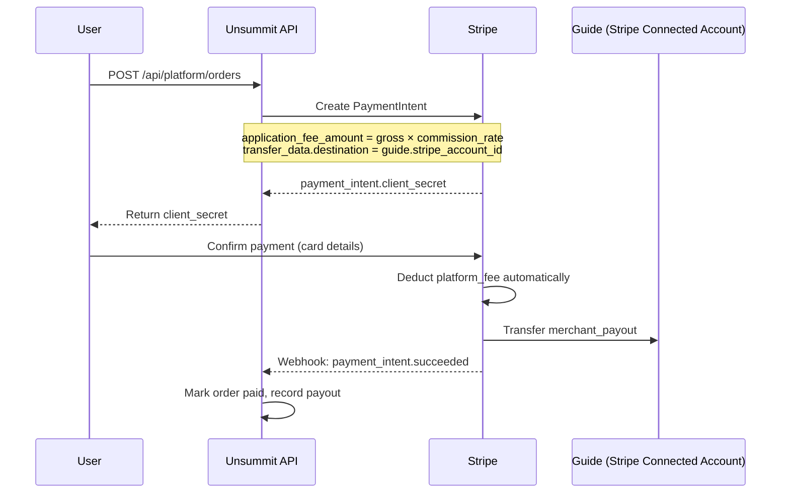
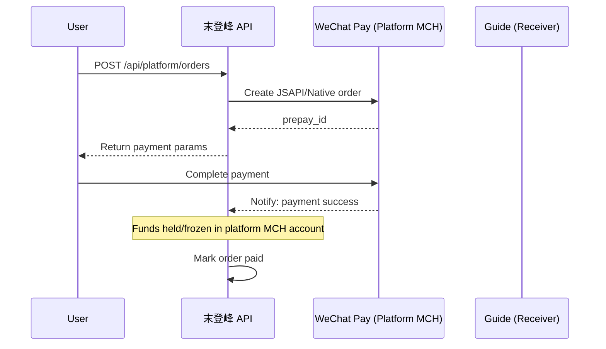
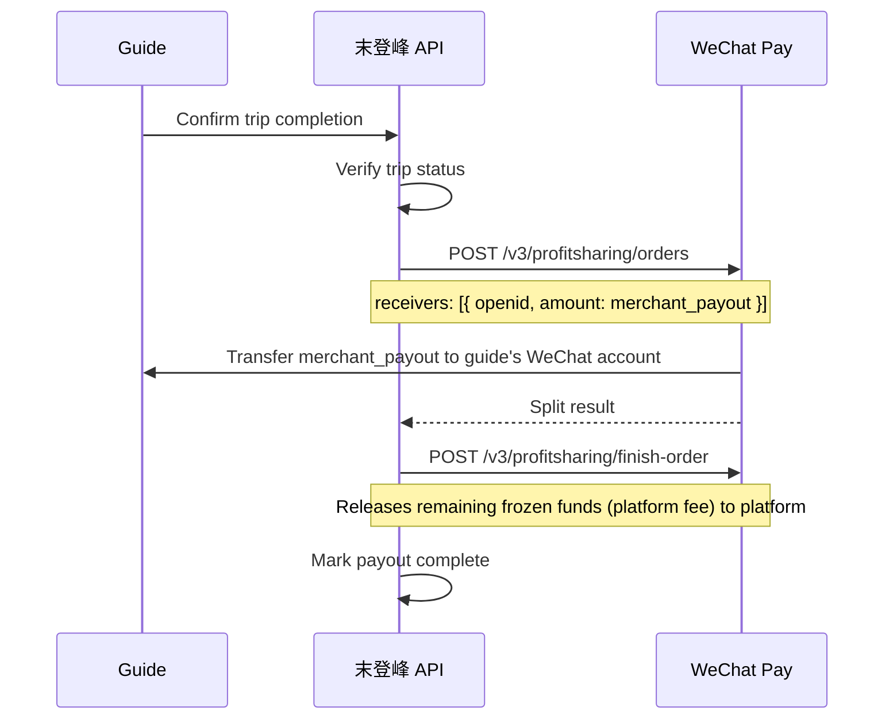

# Payout Flows / 资金流向

**Platform:** Unsummit / 末登峰  
**Version:** 1.0  
**Last Updated:** 2026-05

---

## Table of Contents

1. [Architecture Overview / 架构概述](#overview)
2. [US — Stripe Connect Flow](#stripe)
3. [CN — WeChat Pay Split Flow](#wechat)
4. [Why No Payment License Required / 为什么不需要支付牌照](#compliance)
5. [Error Handling / 异常处理](#errors)
6. [Refund & Dispute Flow / 退款和纠纷处理](#refunds)

---

## 1. Architecture Overview / 架构概述

```
┌─────────────────────────────────────────────────────────────────┐
│                      UNSUMMIT / 末登峰                          │
│                                                                 │
│   US Region (Stripe)              CN Region (WeChat Pay)        │
│   ─────────────────               ──────────────────────        │
│   User → Stripe → Guide           User → WeChat → 末登峰       │
│   (platform auto-deducts fee)     (funds frozen) → Guide       │
│                                   (after completion)            │
└─────────────────────────────────────────────────────────────────┘
```

Both flows use **licensed payment gateways' own split/connect features**.  
The platform **never** holds funds in a proprietary account — this is the key to compliance.

两个区域均使用**持牌支付通道自身的分账/Connect 功能**，平台**不设置自有资金池**，这是合规关键。

---

## 2. US — Stripe Connect Flow

### 2.1 Merchant Onboarding

```
Guide applies → KYC approved → Platform creates Stripe Connect Express account
                               → Guide completes Stripe onboarding (~10 min)
                               → Stripe verifies guide identity
                               → merchant.payout_account = { stripe_account_id }
```

**API reference:** `stripe.accounts.create({ type: 'express' })`

### 2.2 User Payment (with automatic split)



**Key Stripe API call:**

```javascript
await stripe.paymentIntents.create({
  amount: grossAmountCents,       // e.g. 100000 for $1000.00
  currency: 'usd',
  application_fee_amount: platformFeeCents,  // auto-deducted to platform account
  transfer_data: {
    destination: merchant.payout_account.stripe_account_id,
  },
});
```

### 2.3 Payout Schedule

- Stripe automatically transfers funds to the guide's bank account weekly
- Minimum accumulation: $100 before transfer is initiated
- Platform receives its fee in the Stripe platform account automatically

### 2.4 Stripe Webhook Events to Handle

| Event | Action |
|-------|--------|
| `payment_intent.succeeded` | Mark order `paid`, record `payment_intent_id` |
| `payment_intent.payment_failed` | Mark order `payment_failed`, notify user |
| `account.updated` | Sync guide Stripe account status |
| `transfer.created` | Record payout transfer ID |

---

## 3. CN — WeChat Pay Split Flow

> ⚠️ **Status:** Code skeleton complete. Activation pending WeChat merchant account approval and ICP filing.  
> **Control flag:** `WECHAT_SPLIT_ENABLED=false` (default). Set to `true` when ready.

### 3.1 Merchant Onboarding

```
Club/Guide applies → KYC approved → Admin adds merchant as WeChat profit-sharing receiver
                                     (via wechat-split.addReceiver())
                                   → merchant.payout_account = { wechat_mch_id, openid }
```

### 3.2 User Payment



### 3.3 Split After Trip Completion



### 3.4 Environment Variables Required (CN)

```bash
WECHAT_SPLIT_ENABLED=true          # Enable real integration
WECHAT_MCH_ID=                     # 微信商户号
WECHAT_API_KEY=                    # APIv3 key
WECHAT_CERT_SERIAL=                # 证书序列号
WECHAT_PRIVATE_KEY=                # 私钥内容 (PEM)
WECHAT_APP_ID=                     # 公众号/小程序 AppID
```

---

## 4. Why No Payment License Required / 为什么不需要支付牌照

### 合规核心逻辑

中国《支付服务管理办法》规定，**代为保管他人资金**需要持有支付牌照。

末登峰**不保管资金**，原因如下：

1. **用户直接付款给微信支付平台商户号**（末登峰为微信特约商户，而非自建账户）
2. **资金由微信支付托管**，末登峰只是触发分账指令
3. **分账功能是微信支付自身提供的持牌功能**，末登峰调用 API，资金从未进入末登峰对公账户
4. **Stripe Connect 同理**：用户付款给 Stripe，平台通过 `application_fee` 从 Stripe 收取佣金，资金流不经过平台账户

### Legal Reference (US)

Stripe Connect with `transfer_data` is explicitly designed for marketplace platforms and complies with US money transmission regulations. Stripe (as a licensed money transmitter) handles the regulatory compliance.

---

## 5. Error Handling / 异常处理

### Payment Failure / 支付失败

| Scenario | US Action | CN Action |
|----------|-----------|-----------|
| Card declined | Stripe webhook → notify user | WeChat callback → retry page |
| Network timeout | Order remains `pending_payment` for 30 min, then auto-cancelled | Same |
| Duplicate payment | Idempotency key prevents double charge | out_trade_no uniqueness |

### Payout Failure / 分账失败

| Scenario | Action |
|----------|--------|
| Stripe transfer failed | Retry in 24h; alert ops team after 3 failures |
| WeChat split failed | Store `failure_reason`; ops manually investigates |
| Guide Stripe account deactivated | Pause payouts, notify guide, link to re-onboard |
| WeChat receiver not registered | Register receiver first, then retry split |

### Refund Scenarios / 退款场景

See [Section 6](#refunds).

---

## 6. Refund & Dispute Flow / 退款和纠纷处理

### Before Payment / 支付前

Order cancelled → no action needed (no charge taken).

### After Payment, Before Trip / 支付后行程前

```
User requests refund
  → Admin reviews (or auto-approve per cancellation policy)
  → If approved: Stripe refund API / WeChat refund API
  → Payout record cancelled
```

**Stripe:** `stripe.refunds.create({ payment_intent: pi_xxx, amount: refundCents })`  
**WeChat:** `POST /v3/refund/domestic/refunds`

### After Trip / 行程后

Disputes handled by platform arbitration:
- Partial refund possible (admin sets amount)
- Commission is refunded proportionally
- WeChat split already executed → reclaim via `wechat-split.refundSplit()`

### Chargebacks (US Only)

- Stripe handles chargeback process
- Platform mediates with evidence (booking records, communication logs)
- Guide bears liability if chargeback is upheld due to service failure

---

## Appendix: Key Files

| File | Purpose |
|------|---------|
| `backend/lib/commission.js` | Commission rate calculation |
| `backend/lib/payment/wechat-split.js` | WeChat split payment skeleton |
| `backend/lib/region.js` | Region detection and config |
| `backend/prisma/schema.prisma` | `Merchant`, `PlatformOrder`, `Payout` models |

---

*Ops contact: finance@unsummit.com | caiwu@modengfeng.cn*
